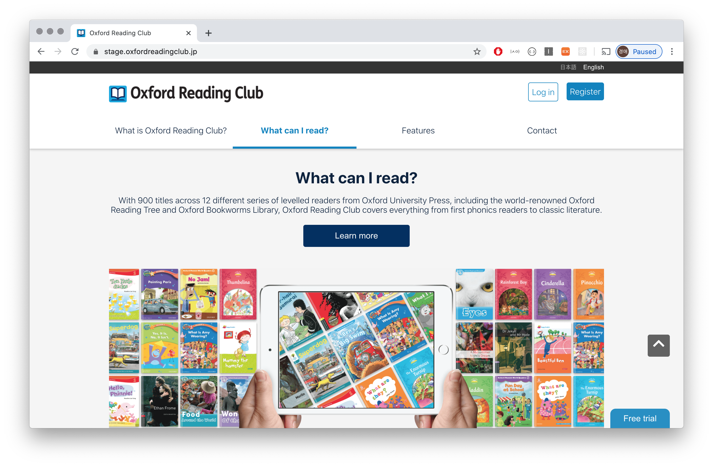
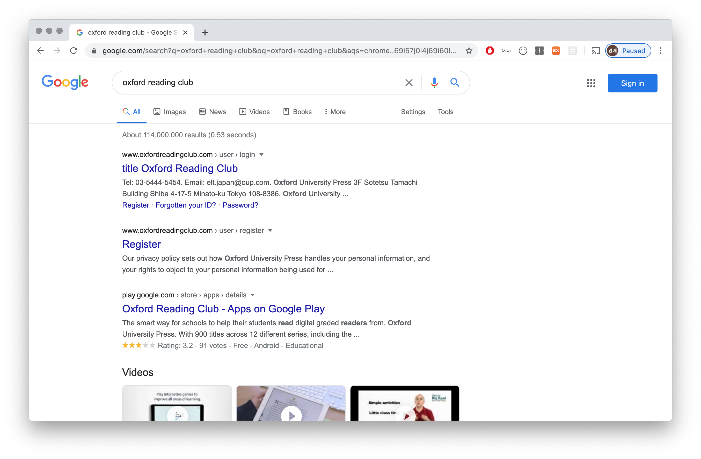

# Cartwheel; Headless Browser를 이용한 웹 사이트 변경 한 눈에 파악하기


## 옆구르기 하면서 봐도 알고 싶다,

Cartwheel는 Oxford Reading Club Expansion - 정확히는 ORC 베트남 프로젝트를 시작하면서 "다른 환경의 웹사이트 또는 이전 버전 웹사이트와 UI 차이점을 한 눈에 확인 할 수 있으면 좋겠다"라는 필요성을 느끼고 시작한 개인 프로젝트입니다. 

이번에 ORC 베트남 프로젝트를 시작하면서 포탈 웹사이트의 전체 웹 페이지 중 70% 정도에 해당하는 페이지들의 HTML 마크업, CSS와 JS를 재작성 했는데요, 의도적인 UI 변경(e.g., 디자인 시스템 반영, 폼 기능 변경에 따른 디자인 변경, Footer 위치 변경, etc)도 있었지만, 그렇지 않은 경우에는 최대한 기존 웹사이트의 모양을 유지하고자 했습니다. 그러다보니 작업 PC에는 디자인 파일, 현재 배포가 된 환경의 포탈 페이지, 작업 중인 환경의 포탈 페이지가 열려 있어야 했고, 심지어는 작업 중인 페이지와 작업 중인 페이지로 영향을 받을 수 있는 다른 개발중인 페이지까지 같이 봐야하는 고통이 계속 되었어요. 

.png)

변경 작업 중 모니터 상황; 상용 버젼 - 작업 버젼 - 작업에 영향을 받는 다른 페이지를 동시에 확인

페이지 별-작업 히스토리 별-환경 별로 차이가 있는지 없는지, 차이가 있다면 어디에 얼마나 있는지 알고 싶다, 이왕이면 좀 쉽게 알고 싶다! 그런 바람으로 Cartwheel - 옆구르기를 만들기 시작했습니다.

## Cartwheel은 이렇게 동작합니다.

1. Crawl a website
    1. 설정된 웹 사이트 주소(e.g., https://local.oxfordreadingclub.com)에 접속합니다.
    2. 접속한 웹페이지에서 모든 `<a>`를 찾고, 거기에 연결되어 있는 사이트 내부 링크(i.e., Hostname이 동일한 웹페이지 주소)를 찾습니다.
    3. 2에서 찾은 내부 링크로 접속하여, 해당 웹페이지에 포함된 모든 사이트 내부 링크를 찾습니다.
2. Take screenshots; (같은 페이지에 중복 접속하지 않도록 중복을 제거 해가며) 2~3을 반복하며 스크린샷을 찍습니다.
3. Create sitemap; 스크린샷을 찍은 페이지에 대해 Request Path, 페이지 타이틀, 스크린샷 파일 정보를 담은 Sitemap을 생성합니다.
4. Compare the screenshots
    - (동일한 Request URL에 대해 이전에 찍어 둔 스크린샷이 있다면) 두 개 스크린샷을 비교하고 10% 이상 변경이 있다면, 다른 영역을 표시하는 diff 이미지를 생성합니다.
    - (웹사이트 설정시 Remote 환경을 설정했다면) 리모트 Hostname + Request Path를 조합하여 리모트 환경 웹페이지 스크린샷을 찍습니다. 그리고 테스트 환경과 리모트 환경의 스크린샷을 비교하여 10% 이상 변경이 있다면, 다른 영역을 표시하는 diff 이미지를 생성합니다.

### Headless Browser를 이용한 테스트 (via Playwright)

Headless Browser == Web Browser - Graphical User Interface

Headless Browser는 GUI 없이 Command-Line Interface (CLI) 또는 Network Communication을 이용하여 웹페이지를 제어 할 수 있도록 하는 브라우저입니다.

일반적으로 다른 Application에 웹페이지 콘텐츠를 제공하기 위해 사용하지만, 데이터 추출이나 웹페이지 테스트 용도로도 널리 사용 중입니다.

특히 웹페이지 테스트에 헤드리스 브라우저가 널리 사용되는 이유는 헤드리스 브라우저가 정말로 브라우저라는 점 때문(!)입니다. 헤드리스 브라우저는 일반적인 브라우저가 웹페이지를 이용하는 것과 완전히 동일한 방식으로 웹페이지를 파싱하고, 렌더링하기 때문에, "브라우저와 유사한(브라우저를 컨트롤 하는 방식의)" 다른 테스트 도구들이 일반적으로 제공하지 못하는 기능, 예를 들자면 Javascript나 AJAX 실행 결과를 확인 할 수 있습니다.

**Playwright - Chromium, Firefox, WebKit headless browser를 하나의 API로 이용할 수 있도록 만든 Node 라이브러리**

1. Headless Browser를 실행

```jsx
const browser = await playwright.chromium.launch();

if (ignoreHTTPSErrors) await browser.newContext({ ignoreHTTPSErrors });
```

2. 웹페이지로 이동 

```jsx
const page = await this.browser.newPage();
await page.goto(url);
```

3. 스크린샷 생성

```jsx
await page.setViewportSize({ width, height });
await page.screenshot({ fullPage, path });
```

### 사용자의 PC에 설치 되는 웹 서버 (via Electron)

목적은 조금 달랐지만 사실 옆구르기는 2017년에 Spindle Weather라는, 지금의 AWS Alarm Bot의 초기 모델이라고도 할 수 있는 Automatic API Test Application에도 들어 있던 기능입니다.

Spindle Weather는 아래와 같은 기능을 가지고 있었습니다.

- 미리 정의해 둔 API 스펙을 기준으로 API가 정상 응답을 하고 있는지를 확인
- 미리 정의해 둔 값을 기준으로 웹사이트에서 정상적으로 로그인이 가능한지 확인
- 웹사이트에 링크된 리소스가 정상 HTTP Status를 반환하는지를 확인
- *웹 사이트를 스크린샷으로 기록하고, 지정한 수준 이상으로 변경이 생기는지를 확인*

웹 사이트는 [PantomJS](https://phantomjs.org/)라는 헤드리스 브라우져를 이용해서, 지금의 옆구르기와 거의 똑같은 작업(크롤링 - 스크린샷 생성)을 했는데요, 문제는 이 작업이 저렴이 서버에서 돌아가기엔 적합하지 않았다는 것이었습니다. Memory Allocate 문제 등으로 서버가 장애 상태에 빠지고, 이게 API 모니터링처럼 중요도가 높은 작업에 영향을 주게 되다보니, 결국엔 스크린샷과 관련된 기능은 개발된 이후 활약 한 번 해보지 못한 채로 비활성화 상태로 바뀌었습니다.

일렉트론에서 리소스 사용에 대한 제약이 줄어 들었고, 부가적으로는 개발중인 웹사이트(localhost)에 대한 스크린샷 생성과 비교가 가능해졌습니다.

## 해야 하는 것! 하고 싶은 것! 할 수 있는 것!

### 로그인 이후의 웹페이지로 확인 대상을 넓히기

현재 옆구르기에서는 로그인 전 사용자가 확인 할 수 있는 페이지에 대해서만 크롤링과 스크린샷 생성 및 비교를 진행합니다. 다음 phase에서는 웹사이트 설정에 로그인 정보를 기입하고, 해당 정보를 활용해서 로그인 이후 접근 가능한 페이지에 대해서도 테스트를 수행하도록 만들어 보려고 합니다. 

### SEO를 고려한 마크업 (페이지 이동을 굳이 JS로 해야만 했냐아!)

검색 엔진을 비롯하여 전통적인 웹사이트 크롤링은 홈페이지(인덱스 페이지)에서 "이동 가능한 링크를 찾는 것"부터 시작됩니다. 만약 페이지에 이동 가능한 링크(`<a>`)가 없다면, 크롤링 할 수 있는 페이지 수는 제한적일 수 밖에 없고, 이에 따라서 원하는 테스트 결과를 얻을 수 없습니다.



_Learn more를 누르면 시리즈 소개 화면이 있는데, 왜 스크린샷은 없을까요? 저 Learn more는 버튼 모양의 링크가 아니라 정말로 버튼이었습니다;_



_"안 돼, 안 찾아줘, 찾아줄 생각 없어, 돌아가."였던 ORC 검색 결과_

### 단순 웹페이지 차이 확인이 아닌, Behaviour와 그에 따른 결과 확인이 가능한 UI 테스트툴로 확장

처음 옆구르기를 "환경-작업 버젼-영향 받는 작업의 차이를 한 눈에 보고 싶다"라는 생각으로 만든 만큼, UI 테스트툴로써 옆구르기는 아주 제한적인 부분만을 테스트합니다. 헤드리스 브라우저가 제공 하는 기능의 극히 일부만 사용한다고 할 수 있는데요, 현재 개발중인 내용을 좀 더 안정화 시킨 후에는 특정 페이지 안에서 Form을 전송하거나, Javascript 실행 후 변경되는 화면을 추가 스크린샷으로 남겨 두는 등의 기능을 추가 할 상상(...)도 해봤습니다.

### 인터넷으로 호스팅 되지 않(아도 되)는 웹 어플리케이션

앞서 얘기했던 Spindle Weather와 똑같이, 수행해야 하는 작업이 많은 웹 서버 자원을 사용해서 종종 서버가 장애 상태가 되는 어플리케이션이 하나 있습니다. 바로 QMS에서 도서에 사용된 단어와 문장을 추출하기 위해 사용하는 SAT Analyzer입니다. 아주 간단한 Natural Language Processing을 하고 있는 이 어플리케이션은 동시에 책 5권에 대한 요청을 처리하게 해두었는데, 이런 제한을 뒀음에도 불구하고 도서의 특성에 따라서는 서버가 뻗는 경우가 생깁니다. 이런 종류의 어플리케이션이 더 있다면 Electron을 활용해서 플랫폼을 바꿔보는 것도 좋을 것 같습니다!

## [부록] 처음으로 Electron을 이용해 어플리케이션을 만들면서 이런 어려움(aka 삽질)을 겪었습니다.

### 1. Uncaught TypeError: Cannot read property 'getPath' of undefined

일렉트론에 Main Process와 Renderer Process가 따로 존재하고, 각각의 프로세스에서 쓸 수 있는 API가 정해져 있다는 것을 모르고 구현부터 하다보니 봐야 했던 에러 메시지 입니다. 웹 사이트 설정값이나 스크린샷, 사이트맵 파일 등의 데이터를 Electron에서 지정한 `userData` 디렉토리에 저장하려고 했는데 렌더 프로세스에서는 `app` API를 이용 할 수 없기 때문에 이 경로를 조회하거나 접근 할 수 없었습니다.

결국 ipcMain/ipcRender를 이용해서 메시지를 주고 받는 형식으로 구현을 했지만, Main Process에 Express로 웹서버를 만들고, 그 웹서버를 통해 요청을 주고 받는 형식이 되었어도 좋았을 것 같다라는 생각을 뒤늦게 하기도 했어요. 이건 또다른 삽질이 되었겠지요;

### 2. Not allowed to load local resource

스크린샷을 userData 디렉토리(MacOS 기준으로 `~/Library/Application Support/Electron/`)에 저장하고 있는데, 이렇게 저장된 이미지를 화면에 불러 오려고 했더니(`img src=file://`), 로컬 리소스를 불러오는 걸 허용하지 않는다는 에러가 발생했습니다. (이것 때문에 1에서 얘기한 대로 Express 서버를 진짜 올릴까 고민함) 결국에는 로컬 파일을 Electron의 API인, nativeImage로 불러온 다음, base64 형태로 인코딩하여 화면에 불러오는 방식으로 해결을 했습니다.

```jsx
const image = nativeImage.createFromPath(`${ localImagePathInUserData }`);
image.toDataURL();
```

### 3. 여전히 삽질 중; Node module was compiled against a different Node.js version

> Native Node modules are supported by Electron, but since Electron is very likely to use a different V8 version from the Node binary installed on your system, the modules you use will need to be recompiled for Electron.

[Using Native Node Modules | Electron](https://www.electronjs.org/docs/tutorial/using-native-node-modules#installing-modules-and-rebuilding-for-electron)

```bash
Error: The module '/path/to/native/module.node'
was compiled against a different Node.js version using
NODE_MODULE_VERSION $XYZ. This version of Node.js requires
NODE_MODULE_VERSION $ABC. Please try re-compiling or re-installing
the module (for instance, using `npm rebuild` or `npm install`).
```

[https://github.com/Automattic/node-canvas/issues/348#issuecomment-27155958](https://github.com/Automattic/node-canvas/issues/348#issuecomment-27155958)

[https://github.com/Automattic/node-canvas/issues/788#issuecomment-234702763](https://github.com/Automattic/node-canvas/issues/788#issuecomment-234702763)

[https://github.com/SOHU-Co/kafka-node/issues/881#issuecomment-396197724](https://github.com/SOHU-Co/kafka-node/issues/881#issuecomment-396197724)

[https://medium.com/flawless-app-stories/gyp-no-xcode-or-clt-version-detected-macos-catalina-anansewaa-38b536389e8d](https://medium.com/flawless-app-stories/gyp-no-xcode-or-clt-version-detected-macos-catalina-anansewaa-38b536389e8d)